# rote — record once, replay by rote

**An LLM figures out a back-office task once, on a legacy UI with no API. The run becomes a typed, versioned, reviewable capability. Production executes it deterministically with no model in the loop, and hands the live session to a human when it can't safely proceed.**

```text
goal ──▶ discovery (LLM drives the real UI) ──▶ capability artifact (draft, YAML)
                                                       │ review · rote approve
                                                       ▼
caller ──inputs──▶ deterministic replay ──▶ succeeded + outputs │ business_outcome │ failed + evidence
                          │ unknown screen / irreversible step
                          ▼
                   human takes the SAME live session ──▶ hands back ──▶ replay resumes
```

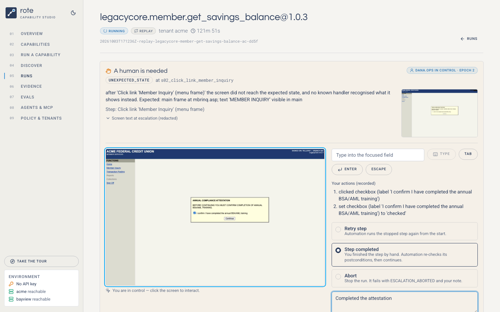
<sub>A replay stopped on a compliance screen no automation knew about. The operator took the same live session in the web UI. They click on the live screen (left), their actions are recorded (right), and they are about to hand control back.</sub>

- Design write-up: **[REPORT.md](REPORT.md)**.
- Runs, artifacts and logs: **[evidence/](evidence/README.md)**.
- Eval datasets and how they are graded: **[Evals](#evals)**.
- Calling a capability from an agent (REST, or MCP over HTTP and stdio): **[Agents & MCP](#agents--mcp)**.

---

## Requirements → where they live

| Brief | What to look at |
|---|---|
| **3.1** goal-driven agent loop | [`discovery/agent.py`](src/rote/discovery/agent.py), [`discovery/decider.py`](src/rote/discovery/decider.py), [`discovery/tools.py`](src/rote/discovery/tools.py); perception in [`surface/perception.js`](src/rote/surface/perception.js) |
| **3.2** structured artifact | [`artifact/schema.py`](src/rote/artifact/schema.py) (+ [`schemas/*.schema.json`](schemas/)), produced by [`discovery/recorder.py`](src/rote/discovery/recorder.py), e.g. [`evidence/artifact-final.yaml`](evidence/artifact-final.yaml) |
| **3.3** deterministic replay + error taxonomy | [`replay/engine.py`](src/rote/replay/engine.py), [`replay/result.py`](src/rote/replay/result.py), vendor handlers in [`capabilities/legacycore/app.yaml`](capabilities/legacycore/app.yaml) |
| **3.4** guardrails | [`config/policy.yaml`](config/policy.yaml), [`policy/policy.py`](src/rote/policy/policy.py), [`policy/redaction.py`](src/rote/policy/redaction.py) |
| **3.5** evidence | [`evidence/runlog.py`](src/rote/evidence/runlog.py); every run writes `events.jsonl`, masked screenshots, redacted DOM and a `report.html` |
| **3.6** human handoff | [`handoff/control.py`](src/rote/handoff/control.py) (lease + fencing), [`handoff/interventions.py`](src/rote/handoff/interventions.py), [`handoff/console.py`](src/rote/handoff/console.py) (operator API); operator surface in the web UI ([`intervention-panel.tsx`](ui/src/components/run/intervention-panel.tsx)) |
| **3.7** heterogeneity & multi-tenant | [`surface/base.py`](src/rote/surface/base.py) (the seam), [`artifact/resolve.py`](src/rote/artifact/resolve.py) (layering), [`config/tenants/`](config/tenants/) |
| Stretch goals | agent-facing catalog (`rote catalog`, [`catalog.py`](src/rote/catalog.py)) served as **MCP tools** and a REST `invoke` endpoint ([`web/agents.py`](src/rote/web/agents.py)); cross-tenant reuse with per-variant overrides; approval gating (draft → approved) |
| Web UI & API | [`web/server.py`](src/rote/web/server.py) (typed OpenAPI contract at `/api/docs`, [`web/models.py`](src/rote/web/models.py)) + [`web/runs.py`](src/rote/web/runs.py) (live runs, event streaming); React app in [`ui/`](ui/), with a landing page and a first-visit guided tour ([`features/tour/`](ui/src/features/tour/)) |
| Evals | [`evals/`](src/rote/evals/) (dataset schema, sandbox, graders, model-graded rubric, runner), datasets in [`evals/datasets/`](evals/datasets/), API in [`web/evals.py`](src/rote/web/evals.py) |

---

## Setup

You need [uv](https://docs.astral.sh/uv/). Python 3.12 and Chromium are installed for you. Tested on macOS; Linux should work the same.

```bash
make setup          # uv sync + playwright install chromium + creates .env from .env.example
```

`.env` is git-ignored:

- **`ANTHROPIC_API_KEY`** is only needed for **discovery** and **probe**. Replay never calls a model.
- The LegacyCore service-account credentials are synthetic demo values for the bundled mock. They are pre-filled, so leave them as they are.

## Web UI

The quickest way to see everything. Use two terminals:

```bash
make bank      # 1. the LegacyCore mock (target app) on :8600
make ui        # 2. the web UI → http://127.0.0.1:8700 (opens your browser)
```

| Page | What you can do |
|---|---|
| **Home** (`/`) | What rote is, how the four stages fit, live numbers from this workspace and the latest eval scores. On a first visit it offers a one-minute **guided tour** across the studio (also under *Take the tour* in the sidebar). Deep links, such as an operator following an intervention link to `/runs/<id>`, never get the tour. |
| **Overview** (`/overview`) | The four-stage flow, library and run statistics, one-click scenarios, recent runs. |
| **Capabilities** | Review an artifact: contract, steps with ordered locators (hover a strategy to see why it's robust), handlers by source, YAML and provenance. *View as* a tenant shows the effective artifact with its override layers. **Approve** drafts here; **Probe** teaches it a business outcome (needs an API key). |
| **Run a capability** | One-click scenarios (happy path, re-ordered rows, no such member, recoveries, human handoff, vendor redesign, another institution), or a custom run: typed inputs, escalation mode and switches that inject faults into the mock. |
| **Run view** | A live step timeline streamed from the engine: locator used, drift warnings, recoveries, outputs and per-step masked screenshots. When the run needs a person, the handoff panel appears. Enter your name, **Take control**, click on the live screen, then **Hand control back** with a resolution and a note. The result card shows outputs, business outcomes, or a failure with expected vs observed. |
| **Discover** | Start an LLM discovery run and watch the model's reasoning, actions and screenshots as it records a draft (needs an API key). |
| **Runs · Evidence · Policy** | Every run and the checked-in evidence, with full timelines; the allowlist, risk rules, vendor handlers and tenant overrides. |
| **Agents & MCP** | How to connect an agent (MCP endpoint, a one-line Claude Code command, a `curl` example), every tool with its schema and hints, and a playground that calls a tool and shows exactly what the agent receives. |
| **Evals** | The three eval datasets with their latest score, a **Run** button (offline stand-in or live model, 1–5 trials), and the history. A result shows the gate, pass rate, pass^k, latency, a meter per tag, and every check per case with a link to that trial's evidence report. |

| The landing page | The first-visit guided tour |
|---|---|
| 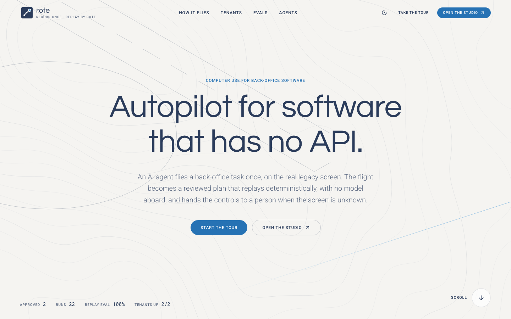 | 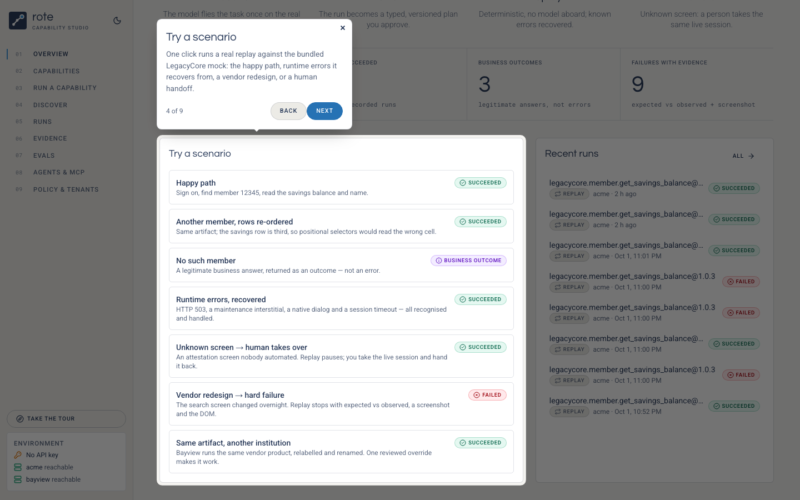 |

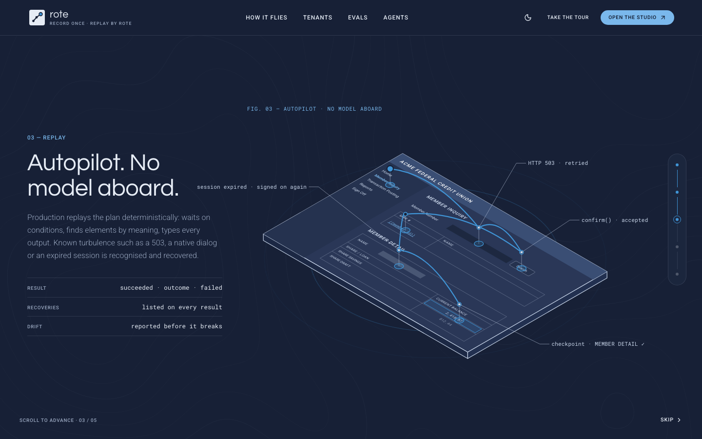

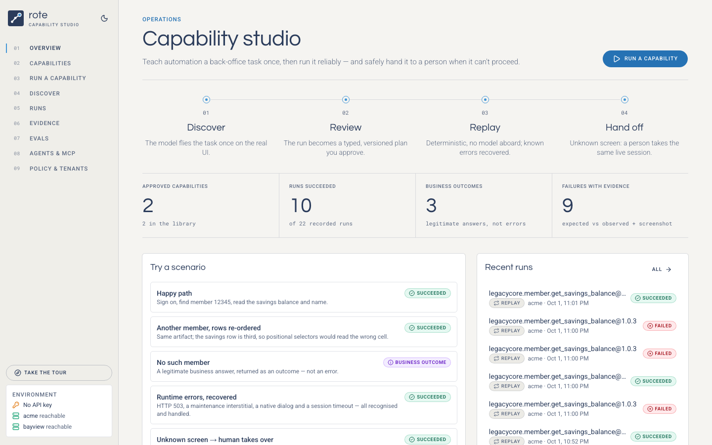

| Reviewing a capability as another tenant | A hard failure, with evidence |
|---|---|
| 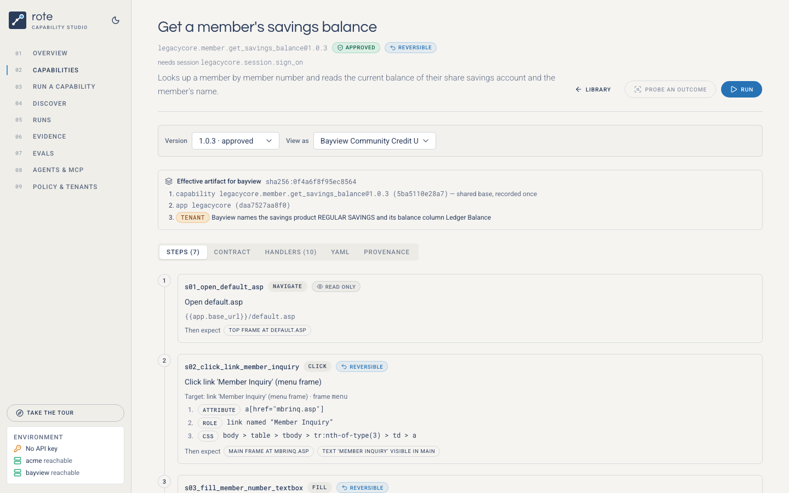 | 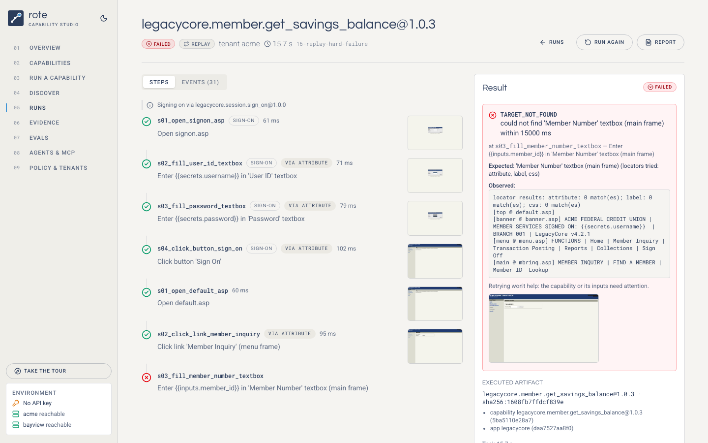 |

The design reads like an engineering drawing: warm paper, navy ink, one sky-blue accent, geometric display type (Questrial) over Roboto, and uppercase tracked labels. The landing page tells the product as a flight. A pinned, scroll-driven story walks through survey, flight plan, autopilot, remote pilot and flight recorder, each with an isometric line drawing of the real system: the LegacyCore frameset, the recorded route across its elements, the operator's desk during a handoff. The drawings are generated from geometry by a small isometric kit ([`components/art/`](ui/src/components/art/)), and the topographic background is computed with marching squares, so nothing is a stock image. Night mode is the same drawing printed on navy. Smooth scrolling (Lenis) and all motion stand down for *reduce motion*. The UI is built with React 19, TypeScript, [shadcn/ui](https://ui.shadcn.com) (Radix primitives + Tailwind CSS 4), lucide icons, TanStack Query, React Router 7, [Motion](https://motion.dev) (animation), [Lenis](https://lenis.darkroom.engineering) (smooth scroll), [driver.js](https://driverjs.com) (the guided tour) and Vite. Studio pages are code-split and load on demand. The built assets are committed under `src/rote/web/static`, so `make ui` needs no Node; `make ui-build` rebuilds them. It is a local workstation tool: it binds to 127.0.0.1 and has no login.

## Demo path (CLI)

Everything in the UI is also scriptable. Start the target app in one terminal and leave it running:

```bash
make bank                   # LegacyCore mock on http://127.0.0.1:8600  (/acme/ and /bayview/)
```

In a second terminal:

```bash
# 1. Discovery: the LLM drives the real UI and records drafts (add --headed to watch)
uv run rote discover "Sign on to LegacyCore with the operator's service account" \
    --kind session --id legacycore.session.sign_on
uv run rote discover "Look up member 12345 and read their current share savings balance and the member's name" \
    -i member_id=12345 --id legacycore.member.get_savings_balance

# 2. Review and approve. Drafts never run unattended.
uv run rote show legacycore.member.get_savings_balance
uv run rote approve legacycore.session.sign_on --reviewer you
uv run rote approve legacycore.member.get_savings_balance --reviewer you

# 3. Deterministic replay (no model). Exit code 0 = succeeded, 2 = business outcome, 1 = failed.
uv run rote replay legacycore.member.get_savings_balance -i member_id=12345
uv run rote replay legacycore.member.get_savings_balance -i member_id=20417   # same artifact, re-ordered rows
uv run rote replay legacycore.member.get_savings_balance -i member_id=12-AB   # rejected before touching the UI

# 4. Teach it business outcomes. One bounded model call classifies the unknown screen.
#    The proposed handler is saved as a new draft version.
uv run rote probe legacycore.member.get_savings_balance -i member_id=99999
uv run rote approve legacycore.member.get_savings_balance --reviewer you
uv run rote replay legacycore.member.get_savings_balance -i member_id=99999   # → MEMBER_NOT_FOUND
```

Then the runtime conditions (the `make` targets inject faults into the mock first):

```bash
make demo-recoveries    # interstitial + native dialog + HTTP 503 + session expiry → all recovered
make demo-hard-failure  # unannounced vendor redesign → TARGET_NOT_FOUND with screenshot + DOM
make demo-handoff       # unknown screen → open http://127.0.0.1:8765, take control, hand back
make demo-tenant        # same artifact on Bayview (relabelled, renamed products, security notice)
make catalog            # approved capabilities as tool definitions a calling agent can use
```

Every run prints its evidence folder; open `report.html` there.

<details><summary>Taking over a session by hand</summary>

**In the web UI** (`make ui`): open **Run a capability** and click **Unknown screen → human takes over**.

1. The replay pauses on an attestation screen nobody automated. The lease goes to *waiting for an operator*, and the handoff panel shows the reason, the step and the masked screen at escalation.
2. Enter your name and click **Take control**. The live screen moves next to the controls and becomes clickable.
3. Tick the checkbox and click **Continue** on the live screen. Each action appears under *Your actions (recorded)*.
4. Choose **Step completed**, add a note, and click **Hand control back**. The engine re-verifies the step's postconditions and finishes the run.

| Waiting for an operator | Handed back and completed |
|---|---|
| 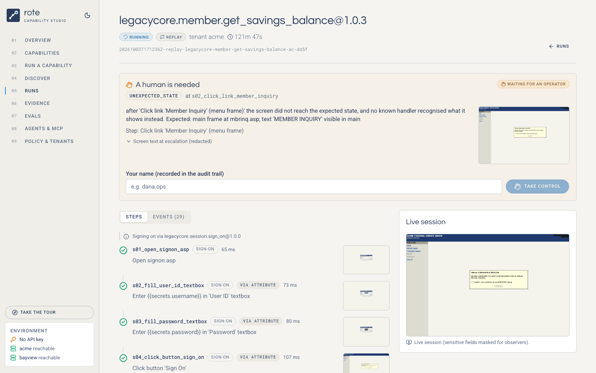 | 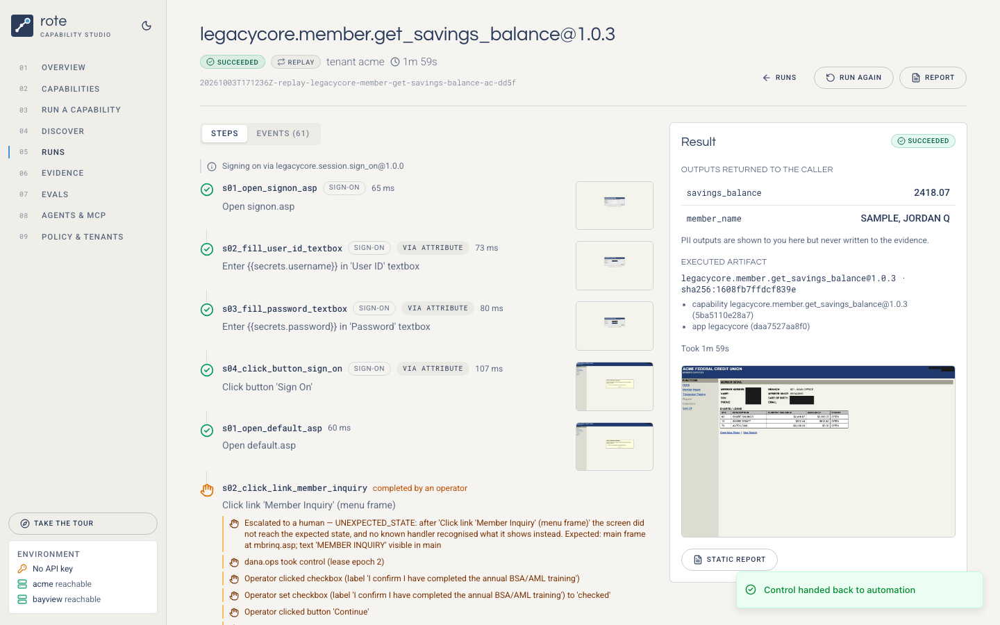 |

**From the terminal** (`make demo-handoff`): the replay prints a minimal console URL (`:8765`) that works the same way, or use `rote operator status | claim | click X Y | type TEXT | press KEY | resolve RESOLUTION`. The record lands in `interventions/<id>.json` either way.
</details>

### Without live services

- **`make test`** runs the full suite (67 Python tests + 18 UI tests). It starts its own mock bank and needs no API key: discovery is driven by a scripted stand-in for the model (`ScriptedDecider`) through the same agent loop and recorder.
- **`make eval`** runs the three eval datasets offline (see [Evals](#evals)).
- **`make evidence-offline`** regenerates `evidence/` with that stand-in. **`make evidence`** does the same with the real model. Both run the full thread: discovery → approval → probe → every replay scenario → multi-tenant.
- **Replay never needs a key.** The capabilities committed under `capabilities/` run against `make bank` as-is.

`evidence/README.md` states which mode produced the evidence you are looking at.

---

## Evals

Tests check that the code does what it says; evals measure how well the system does its job, case by case, against versioned datasets. Datasets are YAML in git ([`evals/datasets/`](evals/datasets/), schema in [`schemas/eval-dataset.schema.json`](schemas/eval-dataset.schema.json)), so a change to what "good" means is reviewed like any other change.

| Dataset | Measures | Cases | Model |
|---|---|---|---|
| [`replay`](evals/datasets/replay.yaml) | The deterministic engine on both tenants: happy paths, re-ordered rows, business outcomes, caller errors, runtime recoveries, slow pages, vendor redesign, unknown screens, with and without the tenant override. Gate: 100%. | 13 | none |
| [`probe`](evals/datasets/probe.yaml) | Screen classification: off-happy-path screens must become *guarded* handlers. Two safety cases (a vendor redesign, a relabelled tenant) must **not** produce a business answer. | 5 | live, or a rule stand-in |
| [`discovery`](evals/datasets/discovery.yaml) | The agent: the recorded artifact is graded on its contract, on being free of data, and by **held-out replays** with members it never saw. In live mode a **model-graded rubric** also grades the contract. | 2 | live, or scripted plans |

```bash
make eval           # all three, offline: no API key, about 3 minutes; exits non-zero if a gate fails
make eval-replay    # replay with 3 trials per case: pass^3 is the determinism check
make eval-live      # probe + discovery with the real model and the rubric judge (needs ANTHROPIC_API_KEY)
uv run rote eval run probe --live --trials 3 --case member-not-found   # any subset, any trial count
uv run rote eval list | show [ID]
```

- **Hermetic.** Every trial runs in its own sandbox: a copy of the library and tenant config, re-pointed at a private mock bank on a free port. Evals never touch `make bank`, its fault switches, your library or your runs. A probe of `@1.0.0` sees the library as it was then (later versions are dropped).
- **Graders** ([`graders.py`](src/rote/evals/graders.py)) are code: every check states what was expected and what was observed. Each trial is also scanned for leaks: no PII input, PII output or credential may appear in its evidence. PII values are compared but never written into results (`[pii]` / `matches`).
- **Model-graded rubric** ([`judge.py`](src/rote/evals/judge.py)): five pass/fail criteria (contract clarity, typed contract, sensitivity labels, reviewable steps, robust targets) with a rationale each, via structured output. The judge only ever sees the artifact, which is data-free by construction.
- **Metrics**: pass rate against the dataset's gate, **pass@k / pass^k** with `--trials`, checks passed, per-tag rates, latency p50/p95, and model cost in live mode. Each result records the dataset's content hash, so scores are only compared on identical datasets.
- **Results** go to `runs/evals/<id>/result.json`, next to every trial's evidence (`runs/<run>/report.html`) and its sandbox (including any artifact a discovery or probe recorded). The **Evals** page in the UI reads the same files; the API is `GET /api/evals/datasets`, `GET /api/evals/results[/{id}]` and `POST /api/evals/runs`.

Offline, the stand-ins measure the harness and everything deterministic around the model. The model itself is measured with `--live`.

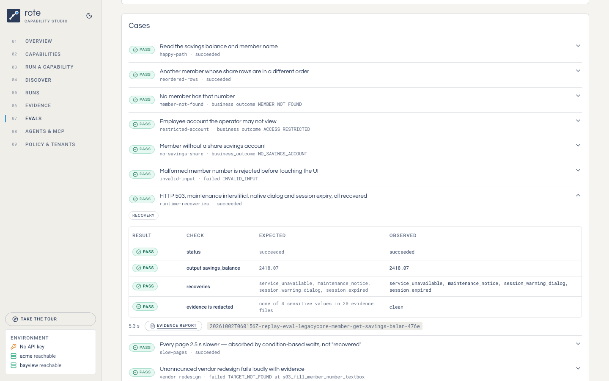

---

## Agents & MCP

A capability's contract is a tool definition (`rote catalog`), so the last step is letting agents call it. Every approved task capability is served three ways, all through one code path ([`web/agents.py`](src/rote/web/agents.py)):

```bash
# 1. MCP over Streamable HTTP, while `make ui` runs
claude mcp add --transport http rote http://127.0.0.1:8700/mcp

# 2. MCP over stdio, for hosts that launch servers (Claude Desktop, IDEs): command `rote mcp`
uv run rote mcp

# 3. REST
curl -s http://127.0.0.1:8700/api/capabilities/legacycore.member.get_savings_balance/invoke \
  -H 'content-type: application/json' -d '{"tenant": "acme", "inputs": {"member_id": "12345"}}'
```

- **Checked before anything starts.** Unknown capability or tenant → 404; no approved version → 409; inputs that break the contract → 422 listing *every* problem. No browser is launched for a call that can't succeed.
- **The answer is the result contract**: `status` (`succeeded` with typed `outputs`, `business_outcome` with a code, `failed` with a code and whether retrying helps), the `capability` version that ran, and links to the run. MCP returns it as `structured_content` (a `failed` run sets `is_error`; a business outcome is not an error).
- **Tools carry MCP hints** from the artifact: `readOnlyHint`/`destructiveHint` from its side effects, `idempotentHint`, and a `tenant` argument listing the configured institutions.
- **Same runs, same evidence.** Calls go through the UI's run manager: they appear live under Runs with screenshots and a report. REST calls can pass `"escalation": "wait"`, so an operator can take over the very session the agent is waiting on. If `wait_s` runs out first, the answer is `202` with `Location: /api/runs/<id>` to poll.

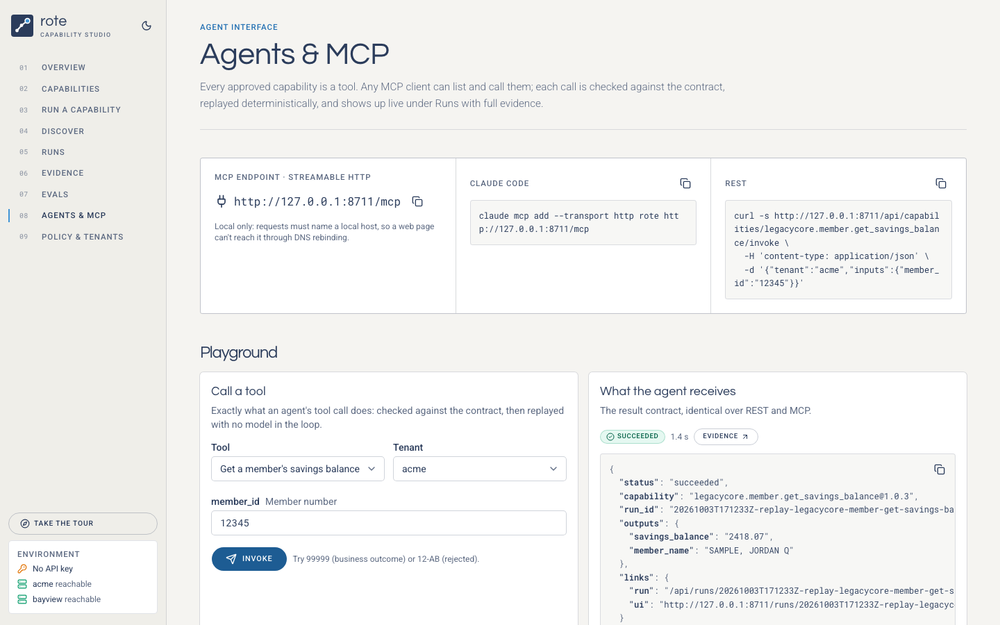

### The control plane (multi-user deployments)

`make up` puts an authenticated **NestJS + PostgreSQL** control plane in front of the engine: users and roles (VIEWER < OPERATOR < REVIEWER < ADMIN), API keys for agents, the four-eyes approval rule, an indexed run history, the handoff queue and an audit trail, at `/api/v1` with OpenAPI at `/api/docs`. Architecture, endpoints, auth flow, configuration and deployment are in **[backend/README.md](backend/README.md)**.

### The HTTP API

The engine's own contract is OpenAPI at **`/api/docs`** (`/api/openapi.json`), with typed responses for every endpoint, grouped as status, capabilities, agents, runs, operator, evals and demo. It is a local workstation API, so it is hardened for that:

- **DNS-rebinding protection.** Requests must name a local host (`127.0.0.1`, `localhost`); anything else gets 400. The MCP transport checks the `Host` and `Origin` headers the same way. This matters because these endpoints can drive a live browser session.
- **Honest errors.** A missing resource gives 404, a conflict 409, and a contract violation 422. An unexpected error returns a 500 with an id that points to the server log. No error ever includes a filesystem path.
- `GET /api/health` is a liveness check that makes no network calls. `GET /api/status` also reports whether each tenant's target app is reachable.

---

## The target app: LegacyCore (mock)

A stand-in for a vendor core-banking back office, built to be hostile to automation:

- a frameset (banner / menu / main);
- table-layout forms whose labels live in neighbouring cells;
- cryptic field names (`MBRNO`, `PSWD`) and no test IDs;
- `javascript:`-driven buttons and native `alert`/`confirm` dialogs;
- volatile URL tokens.

All data is synthetic.

| Tenant | Base URL | Differences |
|---|---|---|
| `acme` (reference) | `/acme/` | v4.2.1 |
| `bayview` | `/bayview/` | v4.3.0. Relabelled fields ("Account No."), renamed products ("REGULAR SAVINGS", "Ledger Balance"), daily security notice after sign-on |

| Member | Why it exists |
|---|---|
| `12345` | happy path |
| `20417` | share rows in a different order (proves reads are anchored by meaning, not position) |
| `31008` | no savings share (`NO_SAVINGS_ACCOUNT`) |
| `40404` | restricted employee account (`ACCESS_RESTRICTED`) |
| anything else | no match (`MEMBER_NOT_FOUND`) |

Faults, set with `uv run mockbank fault acme <name>=<value>` and cleared with `--clear`:

| Fault | Behaviour |
|---|---|
| `maintenance_notice` | interstitial page |
| `session_warning_dialog` | native `confirm()` |
| `transient_errors=N` | HTTP 503 page |
| `session_expire_after=N` | session timeout |
| `slow_ms=N` | slow load |
| `compliance_popup` | an attestation screen nobody automated (forces a handoff) |
| `vendor_upgrade` | redesigned search screen (hard failure) |

## CLI

```text
rote discover GOAL [-i k=v] [--kind task|session] [--id ID] [--tenant T] [--headed]   LLM discovery → draft artifact
rote replay CAP [-i k=v] [--tenant T] [--escalation fail|wait] [--json]              deterministic execution
rote probe CAP -i k=v                       classify an unknown exceptional screen → draft handler
rote show CAP [--tenant T]                  review sheet (effective artifact for a tenant)
rote approve CAP --reviewer NAME            draft → approved
rote ui [--port 8700]                       the web UI + API (review, run, watch live, take over handoffs, /mcp)
rote mcp                                    approved capabilities as MCP tools over stdio
rote list | validate | catalog | schema     library, policy/PII lint, agent tool catalog, JSON Schemas
rote eval list | run DATASET [--live] [--trials N] [--case ID] [--json] | show [ID]    evals (exit 1 if the gate fails)
rote operator status|claim|click|type|press|dialog|resolve     act as the human operator
mockbank serve | fault | ledger | reset     the target app and its fault injection
```

## Configuration

| Variable | Default | Purpose |
|---|---|---|
| `ANTHROPIC_API_KEY` | — | discovery and probe only |
| `ROTE_MODEL` | `claude-opus-5-5` | discovery, probe and eval-judge model |
| `ROTE_EFFORT` | `high` | model effort |
| `ROTE_FALLBACKS` | `1` | server-side refusal fallback |
| `ROTE_CONSOLE_PORT` | `8765` | operator console |
| `ROTE_WEBHOOK_URL` | — | also route interventions to a webhook (Slack, pager, …) |
| `ROTE_RUNS_DIR` | `runs/` | where run evidence is written |

Policy (allowlist, risk rules, sensitive labels) lives in [`config/policy.yaml`](config/policy.yaml); tenants live in [`config/tenants/`](config/tenants/).

## Repository layout

```text
src/rote/
  artifact/    schema (the capability contract), YAML store, tenant/app layering, templates
  surface/     Surface protocol + Playwright WebSurface + in-frame perception (perception.js)
  discovery/   agent loop, Claude decider, tool surface, recorder, probe
  replay/      deterministic engine, result contract, typed values
  handoff/     control lease, intervention broker, operator console
  policy/      guardrail policy engine, redaction
  evidence/    run log, live terminal reporter, report.html
  evals/       eval datasets (schema), hermetic sandbox, graders, rubric judge, runner
  catalog.py   capabilities → agent tool definitions
  cli.py, runtime.py
  web/         `rote ui`: typed API, agents (invoke + MCP), background runs and evals, event streaming (+ built UI)
src/mockbank/  the LegacyCore target app (not part of the system)
backend/       the control plane: NestJS + Prisma/PostgreSQL REST API (see backend/README.md)
ui/            the React + shadcn/ui frontend source (Vite)
capabilities/  the capability library (app profile + versioned artifacts)
config/        policy + tenant bindings/overrides
evals/         eval datasets (results are written to runs/evals/)
evidence/      generated demonstration runs (see evidence/README.md)
scripts/       make_evidence.py, operator_bot.py
tests/         unit + end-to-end (real Chromium against the mock) + the eval harness
.github/       CI: lint, types, tests, offline evals, UI build check
```

## Development

```bash
make check      # everything CI runs: lint, validate, tests, offline evals
make test       # 67 Python tests (unit, end-to-end in a real browser, a handoff through the web UI, the eval
                # harness, REST invoke and MCP over HTTP and stdio) + 18 UI tests (Vitest + Testing Library)
make lint       # ruff check + ruff format --check + mypy; ESLint + Prettier + tsc. All clean.
make fmt        # apply formatters and safe fixes
make hooks      # install the pre-commit hooks (the same tools, from the project's own environments)
make ui-dev     # hot-reloading UI on :5173 against a running `make ui`
make ui-build   # rebuild src/rote/web/static from ui/
```

**Standards, enforced rather than described:**

- **Python**: ruff for lint and format (pycodestyle, pyflakes, isort, bugbear, pyupgrade, simplify, async-safety, comprehensions, pathlib, timezone-aware datetimes, pytest style), mypy with the pydantic plugin, `strict` for new modules (`rote.evals`, `rote.web.evals`, `rote.web.agents`, `rote.web.models`).
- **TypeScript**: `strict` tsc; ESLint flat config with type-checked `typescript-eslint` (strict + stylistic), the React Hooks rules including the React Compiler checks (purity, no setState in effects), react-refresh and jsx-a11y; Prettier with the Tailwind plugin. Zero warnings allowed.
- **CI** ([`.github/workflows/ci.yml`](.github/workflows/ci.yml)) runs all of it, gates on the offline evals, and fails if the committed UI build no longer matches its sources.
