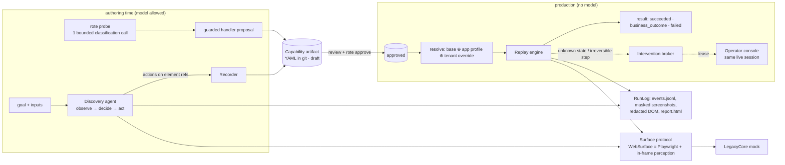

# rote — design write-up

**Rote** turns one LLM-driven run of a back-office task into a typed, reviewable capability, and from then on executes it deterministically, with no model in the loop. The target is a deliberately hostile mock of a legacy core-banking app, "LegacyCore". It uses framesets, table layouts and cryptic field names, has no test IDs, and comes in two tenant variants with injectable runtime faults. The real environment has no API, and the model only matters at authoring time, so I put most of the effort into what happens without the model: the artifact, the replay engine and its error taxonomy, and the safety and handoff model.

## 1. Architecture



**Key decisions**

| Decision | Why | Trade-off |
|---|---|---|
| **Perception = in-frame semantic snapshot + screenshot.** A script injected into every frame lists what a person sees: role, accessible name, the *visual label* (the adjacent cell on table forms) and table column/row. The model acts on element refs, or on coordinates as a fallback. | Coordinates don't replay, and raw selectors on legacy markup carry no meaning. This vocabulary (labels, headers, roles) is also what UI Automation (UIA, Windows), the macOS Accessibility API (AX) and OCR expose, so it carries over to desktop. | A small JS layer to maintain instead of using the browser accessibility tree directly. It handles framesets and unlabelled table forms, which the browser accessibility tree handles poorly. |
| **Custom tools, not the vendor computer-use toolset.** Model: Claude Opus 5.5, adaptive thinking, one tool call per turn. | Recording needs element identity at the moment of each action. A pure pixel click loses it. | The agent is tied to our tool schema. The `Decider` protocol is the seam: a `ScriptedDecider` drives the same loop in tests. |
| **The model is used only at authoring time** (discovery plus one-shot `probe` classification). | Production executions are cheap, fast, reproducible and never send production data to a model. | Unknown screens in production go to a human, not to an LLM fallback. This is deliberate (see §8). |
| **Single process, asyncio.** The operator surface (the `rote ui` web app, or the minimal console a CLI replay starts) runs in the automation's event loop. | The human must drive *the same* live browser session. In-process makes that trivially true. | One session per process. Scale-out is "one worker per session behind a queue", which is designed but not built. |
| **Agents call capabilities as tools: MCP (Streamable HTTP and stdio) and a REST `invoke`, one code path.** | The contract is already a tool definition. Serving it where agents look for tools closes the loop from "recorded" to "used". | Calls are validated against the contract before a browser starts and run through the same run manager, so they are visible, evidenced and hand-off-able like any other run. The cost is one more dependency (the MCP SDK). |
| **Artifacts are YAML in git, validated by Pydantic, with exported JSON Schema.** | Review is a diff, approval is a status change, rollback is a revert. Every run records the effective content hash it executed. | No registry service. That is fine at this scale. |

## 2. Artifact schema

A capability has two halves (`src/rote/artifact/schema.py`):

- **The contract** a calling agent relies on:
  - `id` and semver `version` (MAJOR = contract change, MINOR = steps change, PATCH = locator/handler fixes)
  - `description`
  - typed `inputs` and `outputs`, each with a declared `sensitivity`
  - the business-outcome codes it may return
  - `side_effects`, `idempotent`, and the approval `status`
- **The implementation** replay executes:
  - `steps`, each with a stable `id`, a reviewer-readable `intent`, a `risk`, a multi-strategy `target` and postconditions (`expect`)
  - `handlers` for known exceptional states
  - a `success` checkpoint

Callers depend only on the contract, so tenants and product versions can patch the implementation without changing what the agent is promised. Excerpt (real output; see [`evidence/artifact-final.yaml`](evidence/artifact-final.yaml)):

```yaml
inputs:
  member_id: {type: string, pattern: '^[0-9]{5,10}$', sensitivity: pii}   # never stored as a value
outputs:
  savings_balance: {type: money, sensitivity: internal}
steps:
- id: s05_click_link_member_id
  action:
    type: click
    target:
      frame: {name: main}
      locators:                      # independent strategies, each verified unique when recorded
      - {by: role, role: link, name: '{{inputs.member_id}}'}
      - {by: table_cell, row: '{{inputs.member_id}}', column: 'MBR #', role: link}
      - {by: css, selector: 'body > table:nth-of-type(2) > … > a'}
  expect: [{type: url, frame: main, path: mbrdtl.asp, query: {M: '{{inputs.member_id}}'}},
           {type: text, text: MEMBER DETAIL, frame: main}]
- id: s06_read_savings_balance
  action: {type: extract, output: savings_balance,
           target: {locators: [{by: table_cell, row: SHARE SAVINGS, column: CURRENT BALANCE}]}}
handlers:
- id: member_not_found
  kind: business_outcome
  when: [{type: text, text: NO RECORDS MATCH SEARCH CRITERIA, frame: main}]
  unless: [{type: step_target, step: s05_click_link_member_id}]   # can never pre-empt the happy path
  scope: [s05_click_link_member_id]
  outcome: {code: MEMBER_NOT_FOUND, message: No member has that member number.}
```

**Locator strategies, in preference order.** The order is configured per app.

| Strategy | Why it's robust | Used for |
|---|---|---|
| `attribute` | Form-field `name` and link `href` are the vendor's server contract. They stay the same across tenants and branding. Desktop equivalent: UIA AutomationId. | clicks, fills |
| `role` | Role plus accessible name: what a screen reader announces. | buttons, links |
| `table_cell` | The row whose key cell reads X, in the column whose header reads Y. This survives row reordering; position-based selectors don't. | reads in grids |
| `label` | The text a human reads next to the control. | unlabelled table forms, label/value reads |
| `css` | Structural, last resort. **Never used for reads, never for irreversible steps.** | clicks only |

**Schema invariants** (validator-enforced):

- every template reference is declared;
- every output is extracted exactly once;
- an extract needs at least one non-positional locator;
- `side_effects` can't understate the riskiest step;
- `pii`/`secret` inputs carry no example.

## 3. Determinism & error handling

**Deterministic means same inputs, same decisions.** All branching is driven by declared conditions and never by a model. Waits are condition-based, never fixed sleeps, so a slow app (tested at +2.5 s per page) is absorbed, not "recovered". Each step runs **resolve → policy gate → act → await postconditions**. While waiting, the engine checks every applicable handler on every poll (150 ms) and acts on the first thing that becomes true:

| Class | Examples (all exercised in `evidence/`) | Engine response |
|---|---|---|
| **expected state** | postcondition met | next step |
| **business outcome** | `MEMBER_NOT_FOUND`, `ACCESS_RESTRICTED`, `NO_SAVINGS_ACCOUNT` | return `status: business_outcome`. A legitimate answer, not an error. |
| **recoverable** | maintenance interstitial, native `confirm()`, HTTP 503, session expiry, security notice | dismiss / accept / reload with backoff / re-authenticate and restart (idempotent capabilities only), bounded by `max_attempts`, listed in `recoveries` |
| **known failure** | invalid credentials, function not authorized | `failed`, `KNOWN_APP_ERROR` plus the app's code |
| **unknown** | nothing matched before the timeout | `UNEXPECTED_STATE` / `TARGET_NOT_FOUND`. Escalate to a human (`--escalation wait`) or fail with evidence. |

**Failure result.** Every failure carries:

- its `code` (17 codes, each marked `retryable` or not);
- the step and its intent;
- what was `expected` versus what was `observed` (including per-strategy locator results);
- a masked screenshot and redacted DOM.

**Where handlers come from:**

- the **app profile** (vendor-level: written once, applies to every capability and tenant);
- the **capability** (found by `rote probe`, then reviewed);
- **tenant overrides**.

`rote probe` replays the recorded capability with an input expected to leave the happy path. If replay stops on an unknown screen, one bounded model call classifies it; the model never acts. The proposed handler is verified against the live screen and lands as a draft patch version for review.

**A lesson the tests caught.** The first probed `NO_SAVINGS_ACCOUNT` handler fired on Bayview, where the savings product is simply named differently. Drift was being reported as a confident, wrong business answer. Probed handlers are now *safe by construction*:

- they are scoped to the step that stopped;
- they fire only `unless` that step's target is present;
- if the outcome is inferred from **absence**, they must also see the structure the target is read from (`step_target … part: anchor`, e.g. the column header).

They reference the step **by id**, so tenant overrides flow into them.

**Drift.** Replay resolves *all* of a target's locators, not just the first, and reports disagreement while still succeeding:

- `LOCATOR_DRIFT`: a strategy no longer matches.
- `LOCATOR_FALLBACK`: the primary strategy failed.
- `LOCATOR_CONFLICT`: strategies point at different elements.
- `FRAME_DRIFT`: the target was found in a different frame.
- `VERSION_MISMATCH`: the product version is outside the verified range.

Drift is visible before it breaks anything. Typed outputs are the last net: a mis-targeted read almost never parses as `money`.

## 4. Heterogeneity & multi-tenant

**The surface seam.** Replay and discovery depend only on the `Surface` protocol (`surface/base.py`): observe, resolve, check, act, read and dialogs. The locator vocabulary is semantic, and each adapter interprets it:

| Schema | Web (built) | Windows desktop (UIA) | Pixels only (VDI/Citrix) |
|---|---|---|---|
| `frame` | frame/iframe | top-level window | screen region |
| `attribute` | `name` / `href` | AutomationId | — |
| `role` | ARIA role + name | ControlType + Name | OCR text + detector class |
| `label` | adjacent cell text | LabeledBy / spatial neighbour | OCR text left of the box |
| `table_cell` | header × row key | GridPattern / TablePattern | OCR table structure |

**Legacy web is already the built case:** framesets, table forms, server-rendered pages, native dialogs and no test IDs. A desktop app needs a new adapter, not a new artifact format. The recorder already lifts coordinate clicks back to elements by hit-testing, which on desktop is UIA `ElementFromPoint`.

**Multi-tenant reuse.** Many tenants run the same vendor product. The effective capability is resolved per run as **base artifact ⊕ app profile ⊕ tenant overrides**:

- Overrides are small, reviewed patches keyed by **step id** and scoped to a version range.
- They are never re-recorded copies.
- The effective hash and layers are reported in every result.

Demonstrated with Bayview, which relabels fields, renames products, runs v4.3.0 and enables a security notice:

- **Without an override**, the shared artifact got through:
  - sign-on: the vendor security notice is handled by the app profile, with no tenant work;
  - clicks and fills: vendor-contract attributes carried them;
  - label drift was reported as warnings.

  It then **refused the one read it couldn't do safely**: `TARGET_NOT_FOUND`, not a positional guess and not a wrong "no savings".
- **With one override** (two lines: the Bayview row/column names), it succeeds, and the override also flows into the probed outcome handler.

**At scale**, drift warnings are aggregated per (tenant, capability, version). That aggregate triggers review or re-discovery before anything breaks, and `rote validate` fails on stale overrides.

## 5. Escalation & handoff

**Detect "stuck":**

- Discovery escalates when the model asks (`request_human`), when 3 state-changing actions leave the screen unchanged, when 3 consecutive actions fail or are blocked, or when an irreversible action needs approval.
- Replay escalates on an unknown state, a missing target or exhausted recovery (resolutions: `retry_step`, `step_completed`, `abort`). It also escalates when an irreversible step needs per-run confirmation (`approve`, `reject`).

**Route.** An `Intervention` carries:

- the capability or goal, and the step with its intent;
- the reason code and reason;
- a masked screenshot and the redacted screen text;
- the allowed resolutions.

Notifiers send it to the terminal and an optional webhook (Slack, pager). The web UI (`rote ui`), the minimal standalone console and the `rote operator` CLI are three clients of one operator API (`operator_router`), mounted per live session.

**Transfer control.** The session has exactly one controller, tracked as a lease:

`AUTOMATED → AWAITING_HUMAN (nobody may act) → HUMAN(operator, epoch) → AUTOMATED`

- Every mutating surface call names its actor and is checked against the lease. The lease is enforced, not advisory.
- Each transition bumps an **epoch** (a fencing token). A late click from a stale console tab after hand-back is rejected (409; shown in evidence).
- The operator drives the **same** browser session, either through the UI (screenshot stream plus forwarded clicks, keys and dialog answers, which also works headless) or directly in the `--headed` window. Observers see a masked live view; only the lease holder sees the unmasked screen.
- DOM listeners record every human action with synthesized locators, redacted.
- Input that arrives while automation holds control is logged as `control.unsolicited_input`.

**Hand back.**

- With `step_completed`, the engine **re-verifies the step's postconditions** before continuing.
- With `retry_step`, it re-runs the step.
- In discovery, the human's actions become recorded steps marked `source: human`.

The full sequence is in `evidence/17-replay-human-handoff`.

## 6. Safety

**Allowlist, at three levels:**

- **Network:** browser request interception aborts any origin outside `allowed_origins`, whatever the agent chose.
- **Action:** every discovery and replay action is checked against allowed action types and blocked targets (e.g. password administration).
- **Artifact:** `rote validate` checks actions, base-URL-relative navigation and PII.

**Risk handling.** Actions are classified `read_only`, `reversible` or `irreversible`, from name rules ("Post", "Transfer", …) combined with the artifact's declared risk. The effective risk is the maximum of the two, so a benign label can't downgrade a reviewed risk.

- Discovery **never commits an irreversible action autonomously**: it escalates for approval.
- Replay runs irreversible steps only in **approved** capabilities, and by default also requires per-run operator confirmation (maker-checker, the norm for money movement).
- Positional locators can never drive an irreversible step.
- Drafts don't run unattended. Every probe and re-recording produces a new draft version.

**Data.** The model works with **references, not values**: inputs and credentials appear to it as `{{inputs.member_id}}` and `{{secrets.password}}`, and it fills fields by name. Three redaction layers apply to everything persisted and to model input:

- known values;
- field-aware masking (anything next to labels such as SSN or date of birth);
- patterns: SSN, Luhn-checked card numbers, account numbers, email, phone.

Screenshots are masked in the DOM before capture. PII outputs are registered the moment their target is on screen, using the artifact's own extract targets, so even earlier screenshots are masked. A final pass re-redacts all text evidence. PII outputs are returned to the caller but never persisted. Artifacts can't contain data: the recorder sanitizes and `validate` lints. A test asserts that no member data or credential appears anywhere in the evidence.

**Limits:**

- Free-text PII such as names can't be pattern-matched. Discovery should therefore run in a UAT tenant with test members and under zero-retention terms; production replay never sends data to a model.
- The operator's live view is unmasked: they are an entitled user. Only what is persisted is masked.
- Risk classification is heuristic. The real control is a least-privilege service account per capability class.
- Secrets come from environment variables, not a vault.
- Playwright traces stay off because they can't be redacted.

## 7. Evaluation

Tests say the code does what it claims. Evals measure the system against versioned datasets (`evals/datasets/*.yaml`, Pydantic-validated, JSON Schema exported), one dataset per part that can regress:

| Dataset | What a case pins | What it catches |
|---|---|---|
| `replay` (13) | inputs, tenant, injected faults → exact status, outputs, outcome or failure code, recoveries, tolerated drift | engine, artifact or tenant-config regressions. No model is involved, so the gate is 100%, and `--trials 3` turns pass^3 into a determinism check. |
| `probe` (5) | an off-happy-path screen → handler proposed or not, kind, code pattern, evidence type, and that the handler is guarded | misclassification, and the safety property: a vendor redesign or a relabelled tenant must **not** come out as a business answer |
| `discovery` (2) | a goal → declared contract, sensitivity, turn and cost budgets, held-out replays on unseen members | an artifact that only works for the member it was recorded on, data leaking into an artifact, a weak contract |

**Decisions:**

- **Hermetic by default.** Each trial gets a copy of the library and config, re-pointed at a private mock bank, so probes and discoveries (which write versions) cannot contaminate each other, and a score never depends on what `make bank` was left doing.
- **Code graders first; the model grades only what code can't.** Every check records expected vs observed. The rubric judge (pass/fail per criterion with a rationale, via structured output) grades contract quality on the artifact alone, which is data-free by construction.
- **Privacy applies to evals too.** Each trial's evidence is scanned for PII inputs, PII outputs and credentials, and PII values are compared but never persisted in results.
- **Generalisation over replay of the recording.** Discovery is graded by replaying its artifact on members it never saw: the brief's "generalises" requirement, measured.

**Limits.** Offline, scripted stand-ins replace the model, so `make eval` measures the harness and the deterministic system around the model, not the model. All three datasets pass offline. The live numbers (`make eval-live`) need an API key and were not produced for this submission. The datasets are small: they cover each behaviour once, not a distribution, so they are a regression gate, not a benchmark.

## 8. Cuts

**Deliberately not built:**

- **LLM-assisted recovery during replay.** It would put a model back into production execution. Humans handle unknown screens live; `probe` turns recurring ones into reviewed handlers offline.
- **A production operator console.** The web UI is a local, single-user tool. Missing: CDP screencast/WebRTC streaming, operator authentication and authorization, multi-user routing, and persistence of interventions beyond JSON files.
- **Scale-out.** No queue, worker pool or session pooling. Each replay signs on afresh.
- **Other surfaces.** No desktop or pixel adapters, beyond the designed seam.
- **A second capability.** "Open new sub-account to confirmation" is supported by the mock, including an irreversible **Post** that the policy blocks. It was not recorded.

**Next, in order:**

1. Aggregate drift and outcome telemetry per (tenant, capability, version), and gate unattended replay on a stability score.
2. A UIA adapter that implements `Surface`.
3. A session pool, so sign-on isn't repeated per invocation (it matters more now that agents call capabilities over MCP).
4. Re-discovery that proposes a *diff* against the existing version instead of a new artifact.
